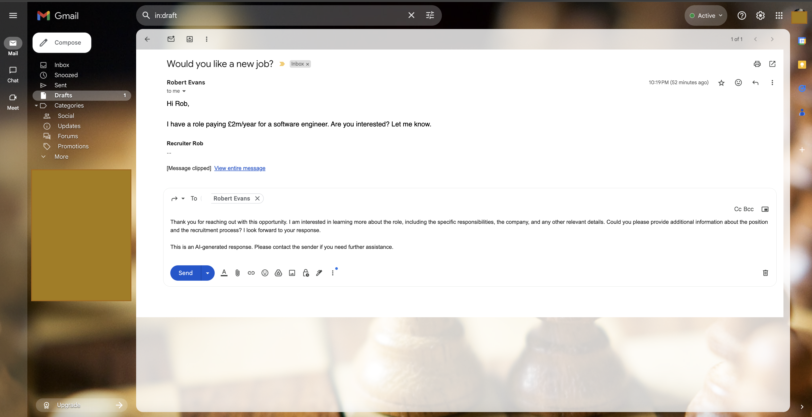

## AI Email Auto Responder

After hearing how AI can respond to emails for you I asked Claude 3.7 to generate for me an AI Auto Responder.
This is what it implemented (almost entirely). With much tweaking I got it working...

### Where Claude fell short

- Dependencies in the `build.gradle` I had to compile myself with relevant (more up to date) versions
- the OpenAiResponse did not ignore unknown fields in the json so I had to fully flesh this out manually
- Initially I used gpt-4 model which is expensive. I've instead reverted to a considerably cheaper (slightly slower) gpt-4o model
- The code was provided to integrate with outlook, but I've disabled this as I don't have access to an outlook account for testing.
- 5+ deprecated APIs were utilised. These have been amendd.

### Setup Instructions

Software:
- Java 17
- gradle 8

Configuration:
- Ask ChatGpt how to enable gmail API for your account.
- When you start up the app you will be prompted on the console output to click a link to authorise the application to access your email. You will need the relevant scopes enabled.
- You will be able to generate a token file which you must then store under this project's root dir -> {rootProjectDir}/src/main/resources/credentials/gmail-credentials.json which is referenced from the main application.properties
- you will also need to setup an OpenAI API key and add it to your env variables : `export AI_API_KEY=your_api_key_here`
